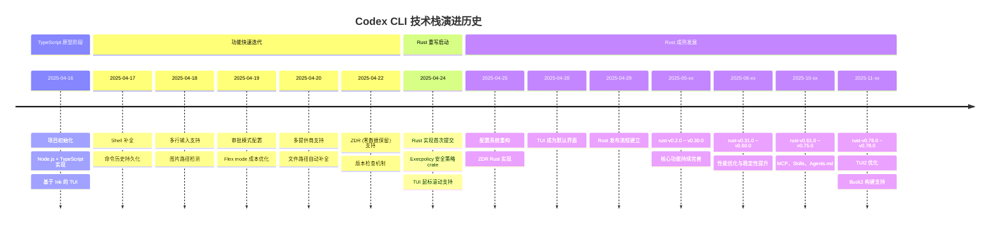

# Codex CLI 代码演进历史

## 项目概述

**Codex CLI** 是 OpenAI 开发的本地运行的编程助手工具，帮助开发者通过自然语言与代码库交互。该项目经历了从 TypeScript 原型到 Rust 重写的完整演进过程。

- **仓库**: openai/codex
- **首次提交**: 2025-04-16
- **主要贡献者**: Ilan Bigio, Michael Bolin, Thibault Sottiaux 等
- **当前版本**: rust-v0.78.x (活跃开发中)
- **许可证**: Apache-2.0

---

## 技术栈演进时间线



---

## 主要开发阶段

### 阶段 1: TypeScript 原型期 (2025-04-16 初期)

**关键里程碑**:
- 项目由 Ilan Bigio 创建初始提交
- 使用 Node.js + TypeScript 快速开发原型
- 实现基础的命令行交互界面 (Ink-based TUI)

**核心贡献**:
- 基础的 LLM 对话能力
- 文件读写操作
- 简单的审批机制

### 阶段 2: 功能扩展期 (2025-04-16 ~ 2025-04-24)

**关键功能添加**:

1. **交互体验增强**
   - Shell 命令补全 (#138)
   - 命令历史持久化 (#152)
   - 多行输入支持 (#438)
   - 文件路径 Tab 补全 (#279)
   - 图片路径检测 (#189)

2. **安全与配置**
   - Execpolicy: 定义"安全命令" (#629)
   - 审批模式配置文件支持 (#298)
   - 用户自定义安全命令 (#386)

3. **成本与性能**
   - Flex mode 成本优化 (#372)
   - 速率限制重试机制 (#105, #153)
   - 版本更新通知 (#333)

4. **多提供商生态**
   - 支持多个 LLM 提供商 (#247)
   - 自定义提供商配置 (#537)
   - OpenAI Organization/Project headers (#626)

5. **企业功能**
   - ZDR (Zero Data Retention) 支持 (#481)
   - API key 管理改进 (#523)

### 阶段 3: Rust 重写期 (2025-04-24 开始)

**重写动机**:
- 性能提升 (编译型语言 vs 解释型)
- 内存安全 (Rust ownership system)
- 更好的跨平台支持
- 减少依赖体积 (单一可执行文件)

**关键提交**:
```
2025-04-24 | 31d0d7a30 | feat: initial import of Rust implementation of Codex CLI in codex-rs/ (#629)
```

**由 Michael Bolin 主导**, 引入完整的 Rust 代码库到 `codex-rs/` 目录

**初期 Rust 功能**:
- `codex_execpolicy` crate: 安全策略系统
- TUI 鼠标滚动支持
- ZDR Rust 实现
- 配置加载系统重构 (Config + ConfigOverrides)

### 阶段 4: Rust 成熟与生态建设 (2025-04-25 ~ 至今)

**版本发布节奏**:
- **rust-v0.1.x ~ v0.10.0** (2025-04 ~ 05): 核心功能对齐 TypeScript 版本
- **rust-v0.11.0 ~ v0.30.0** (2025-05 ~ 06): 稳定性与性能优化
- **rust-v0.31.0 ~ v0.60.0** (2025-06 ~ 10): 新功能探索
- **rust-v0.61.0 ~ v0.78.0** (2025-10 ~ 12): 高级功能与生态集成

**重要功能节点**:

#### v0.20 ~ v0.40 时期
- Session 会话管理系统
- 多目录工作区支持 (`--add-dir`)
- 改进的错误诊断
- Nix flake 支持

#### v0.40 ~ v0.60 时期
- **MCP (Model Context Protocol)** 集成
- **Skills** 系统: 自定义技能/命令
- **AGENTS.md**: 项目级指令与记忆
- Execpolicy DSL 增强

#### v0.60 ~ v0.78 时期
- **TUI2**: 全新终端界面 (多点击选择、内联搜索)
- **Buck2** 构建系统支持
- Ripgrep 下载诊断改进
- 性能优化: 60fps 重绘限制
- 统一的 exec 命令输出限制

**最新开发 (v0.78.x)**:
```
2025-12-23 | 96a65ff0e | perf(tui): cap redraw scheduling to 60fps (#8499)
2025-12-23 | f2b740c95 | fix(codex-cli): improve ripgrep download diagnostics (#8486)
2025-12-23 | 0130a2fa4 | feat(tui2): add multi-click transcript selection (#8471)
2025-12-23 | 53eb2e9f2 | [tui] add optional details to TUI status header (#8293)
```

---

## 核心架构演进

### TypeScript 架构

```
codex (TypeScript)
├── src/
│   ├── cli/           # 命令行入口
│   ├── components/    # Ink React 组件
│   ├── llm/          # LLM 提供商抽象
│   ├── tools/        # 文件操作、命令执行
│   └── config/       # 配置管理
└── package.json
```

**技术选型**:
- **UI**: Ink (React for CLI)
- **LLM**: OpenAI SDK + 自定义提供商抽象
- **配置**: TOML parser
- **运行时**: Node.js

### Rust 架构

```
codex-rs/
├── codex-cli/              # CLI 入口与主逻辑
├── codex-rs/               # 核心运行时
├── codex-execpolicy/       # 安全策略引擎
├── codex-utils-*/          # 工具库集合
├── sdk/                    # TypeScript SDK (保留)
├── shell-tool-mcp/         # MCP 服务器
└── docs/                   # 文档
```

**技术选型**:
- **UI**: Ratatui (Rust TUI 库)
- **HTTP**: Reqwest
- **异步**: Tokio
- **配置**: Serde + TOML
- **构建**: Cargo + Buck2 (可选)

**关键 Crates**:
- `codex-cli`: 主程序入口
- `codex-rs`: 核心功能 (LLM 调用、会话管理、工具执行)
- `codex-execpolicy`: 安全策略 DSL 解析与执行
- `codex-utils-cargo-bin`: 测试工具 (替代 `assert_cmd`)
- `codex-network-proxy`: 网络代理支持

---

## 关键功能演进对比

| 功能 | TypeScript 实现 | Rust 实现 | 首次引入 |
|------|----------------|-----------|----------|
| **基础对话** | :white_check_mark: | :white_check_mark: | 2025-04-16 |
| **文件读写** | :white_check_mark: | :white_check_mark: | 2025-04-16 |
| **审批模式** | :white_check_mark: | :white_check_mark: | 2025-04-19 |
| **Execpolicy** | :white_check_mark: | :white_check_mark: (增强) | 2025-04-24 |
| **ZDR** | :white_check_mark: | :white_check_mark: | 2025-04-22 |
| **Session 管理** | 基础 | 完整 (恢复/列表) | Rust v0.20+ |
| **MCP 支持** | :x: | :white_check_mark: | Rust v0.40+ |
| **Skills 系统** | :x: | :white_check_mark: | Rust v0.50+ |
| **AGENTS.md** | :x: | :white_check_mark: | Rust v0.40+ |
| **TUI2** | :x: | :white_check_mark: | Rust v0.70+ |
| **Buck2 构建** | :x: | :white_check_mark: | Rust v0.78+ |

---

## 版本发布策略

### TypeScript 版本
- 发布到 npm: `@openai/codex`
- 版本号格式: `0.1.YYYYMMDDHHMM` (基于时间戳)
- 发布频率: 不定期 (已逐步停止)

### Rust 版本
- **Alpha 版本**: `rust-v0.X.0-alpha.Y` (测试新功能)
- **稳定版本**: `rust-v0.X.0` (正式发布)
- 发布渠道:
  - GitHub Releases (二进制)
  - npm: `@openai/codex` (包装 Rust 二进制)
  - Homebrew: `brew install --cask codex`

**当前状态** (2025-12-28):
- 最新稳定版: rust-v0.77.0
- 最新 Alpha: rust-v0.78.0-alpha.9
- 发布频率: 每周 1-2 个 alpha 版本

---

## 社区与贡献

### CLA (贡献者许可协议)
- 从 2025-04-16 起实施
- 所有贡献者需签署 CLA
- 自动化机器人 `github-actions[bot]` 处理签名

### 开源基金
- 项目支持 [开源基金](docs/open-source-fund.md)
- 回馈开源生态

### 主要贡献者 (按提交数)
1. **Michael Bolin** - Rust 重写主力, TUI 架构师
2. **Ilan Bigio** - 项目创始人, TypeScript 原型
3. **Thibault Sottiaux** - 早期功能开发
4. **Josh McKinney** - TUI2 性能优化
5. **Ahmed Ibrahim** - 模型系统重构

---

## 技术决策与权衡

### 为什么从 TypeScript 迁移到 Rust?

**TypeScript 的优势**:
- 快速原型开发
- 丰富的 npm 生态
- 团队熟悉度高

**TypeScript 的痛点**:
- 启动速度慢 (Node.js 运行时)
- 内存占用较高
- 分发困难 (需要 Node.js 环境)

**Rust 的优势**:
- 单一可执行文件, 无运行时依赖
- 更快的启动速度与执行性能
- 内存安全保证
- 更好的跨平台支持 (musl libc)

**迁移成本**:
- 需要重写所有核心逻辑
- 学习曲线较陡
- 但长期收益显著

---

## 未来展望

基于当前开发趋势, Codex CLI 可能的发展方向:

1. **Agent 能力增强**
   - 更复杂的多步骤任务
   - 工具调用链优化

2. **IDE 集成深化**
   - VS Code / Cursor / Windsurf 插件
   - LSP 协议支持

3. **企业级功能**
   - 团队协作支持
   - 审计日志完善
   - 自定义模型部署

4. **性能持续优化**
   - 更快的响应速度
   - 更低的资源占用

5. **生态扩展**
   - 更多 MCP 服务器
   - 社区 Skills 市场

---

## 参考资源

- **GitHub 仓库**: https://github.com/openai/codex
- **发布记录**: https://github.com/openai/codex/releases
- **官方文档**: ./codex/docs/
- **TypeScript SDK**: ./codex/sdk/typescript/
- **MCP 规范**: https://modelcontextprotocol.io/

---

*文档生成时间: 2025-12-28*
*基于 Git 提交历史分析至: b92823cf5 (2025-12-28)*
